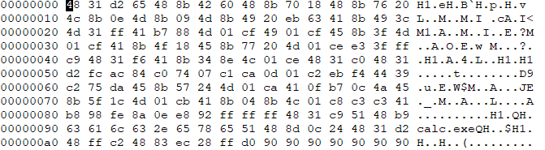
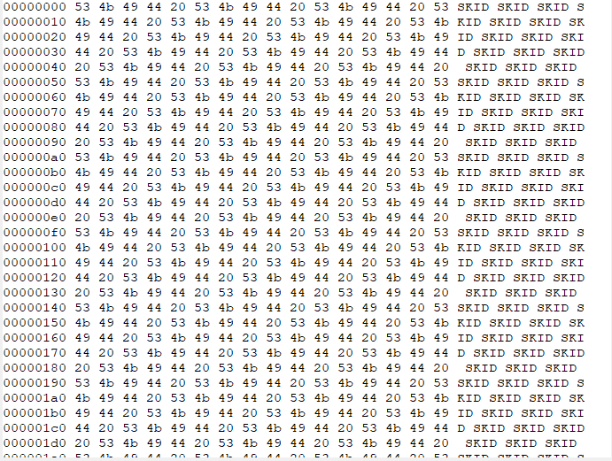
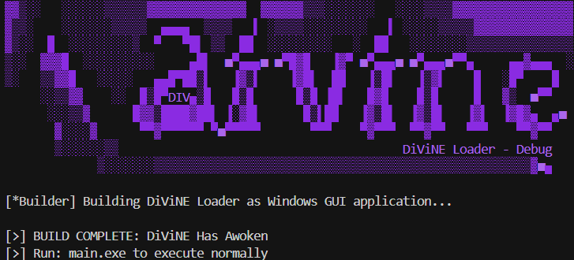
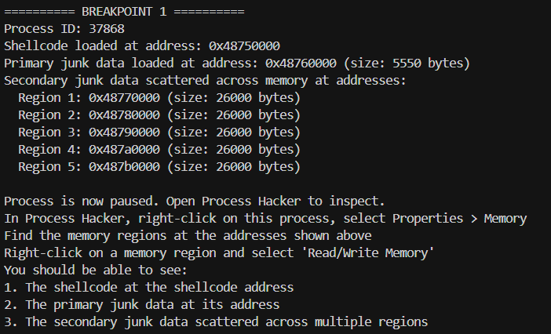

# DiViNE Loader by Debug

## What is DiViNE?
DiViNE is a personal project learning maldev and some included analysis for the gang. DiViNE Loader is a Windows executable that is disguised as a legit application, and even fails to mislead the "victim". It's designed to show how malware can hide malicious functionality mixed with legitimate functionality in the background (Performing crypto/decryption operations, fibonacci calculations for work load, etc.). This specific implementation executes a harmless payload (launching the Windows calculator) but uses techniques common in real-world malware.

<p align="center">
  
</p>

**IMPORTANT: This is for educational purposes only. Do not use this code for any malicious purposes. It's pretty bad anyway.**

## What It Does
The program:
1. Runs invisibly as a Windows GUI application with no display
2. Shows a fake .NET framework 4.8 error message after 3 seconds
3. Loads shellcode (disguised as configuration UUIDs) in the background
4. Executes the shellcode, which launches the Windows calculator

## How It Works
The program uses several techniques to hide its true purpose:

1. **🛹 Fakie**: Shows a fake .NET framework error message after 3 seconds
2. **🥸 Obfuscation**: Stores shellcode as UUIDs to avoid detection
3. **🔍 Malware Analysis**: Injects junk data into memory including calling the security analyst a skid
4. **🪝 Windows API Abuse**:
   - Uses UuidFromStringA to convert UUIDs to binary shellcode
   - Uses VirtualAlloc to allocate executable memory
   - Uses CreateThread to execute the shellcode
5. **🎣 Misdirection**: Displays an error message while executing shellcode in the background
6. **🔄 Double XOR**: Looks like legitimate encryption/decryption operations
7. **🥷 Stealth Mode**: Runs as a Windows GUI application with no console window




## technical implementation
- The shellcode is stored as UUIDs in the `configItems` array
- The shellcode is extracted using Windows UUID conversion functions
- Memory is allocated with RWX permissions
- The shellcode is copied to this memory
- A new thread is created to execute the shellcode
- The shellcode finds and calls WinExec to launch calc.exe

## Building and Running



### Build Nstructions
```bash
# Option 1: Use the PowerShell build script (recommended for Windows)
.\build.ps1

# Option 2: Use the Go build script
go run build/build.go

# Option 3: Use the shell script (for Linux/macOS)
chmod +x build.sh
./build.sh

# Option 4: Build manually with the windowsgui flag
go build -ldflags="-H windowsgui" main.go

# Option 5: Cross-compile from non-Windows platforms
GOOS=windows go build -ldflags="-H windowsgui" main.go
```

### Important Shii

#### GUI vs console builds
- If you build with the standard `go build` command without the `-ldflags="-H windowsgui"` flag, the application will display a warning and prompt you to rebuild it correctly. While it will still function, the console window will remain visible.

#### Analysis builds
- **For analysis mode to work properly, you must build without the windowsgui flag**
- The analysis mode requires a console window for input/output
- Use one of these methods to build for analysis:
  ```bash
  # Method 1: Use the PowerShell build script with analysis flag (recommended for Windows)
  .\build.ps1 --analysis
  # or
  .\build.ps1 -a

  # Method 2: Standard Go build (creates a console application)
  go build main.go

  # Method 3: Use the Go build script with analysis flag
  go run build/build.go --analysis
  ```
- **IMPORTANT**: There are two separate steps:
  1. First, build the application for analysis mode (without windowsgui flag)
  2. then, run the application with the analysis flag: `./main.exe --analysis` or `./main.exe -a`
- If you build with the windowsgui flag and try to use analysis mode, the breakpoints won't work correctly because there's no console window for interaction
- **Reason**: Building with `go run build/build.go` (without the `--analysis` flag) and then trying to run with `./main.exe -a` won't work because the executable was built as a GUI application without a console

### Running the Application
```bash
# Run normally (shows error after 3 seconds)
./main.exe

# Run without showing the error message
./main.exe --no-error

# Run in analysis mode (enable breakpoints and analysis features)
./main.exe --analysis
# or
./main.exe -a
```

### Analysis Mode
the `--analysis` (or `-a`) flag enables special features for analyzing the shellcode execution:

1. **Keeps the console window visible** - Even when built as a GUI application
2. **disables silent mode** - Shows all console output
3. **enables breakpoints** - Pauses execution at key points for analysis
4. **junk data** - Injects junk data into memory
5. **provides guidance** - instructions for using Process Hacker

### Process Hacker Integration
When running with the `--analysis` flag, the code includes a built-in breakpoint and analysis features:

**analysis breakpoint**: Pauses execution right before the shellcode is executed
   - Shows the process ID and memory address where shellcode is loaded
   - Displays the first 32 bytes of the shellcode for verification
   - Injects two types of junk data into memory:
     - Primary junk data in one large memory region
     - Secondary junk data scattered across multiple memory regions
   - Gives you time to attach Process Hacker or other analysis tools
   - Located at line 444 in main.go

After shellcode execution, the program will display a completion message and continue running. Any processes launched by the shellcode (such as calc.exe) should be visible in Process Hacker.

#### Analysis Guide:

1. **Prepare for analysis**:
   - **Step 1**: Build the executable specifically for analysis mode:
     ```bash
     # Option 1: Use the PowerShell build script (recommended for Windows)
     .\build.ps1 --analysis
     # or
     .\build.ps1 -a

     # Option 2: Use the standard build (console application)
     go build main.go

     # Option 3: Use the Go build script with analysis flag
     go run build/build.go --analysis
     ```
   - **Step 2**: Run with the analysis flag:
     ```bash
     ./main.exe --analysis
     # or
     ./main.exe -a
     ```
   - **IMPORTANT**: Both steps are required:
     1. You must build without the windowsgui flag (for console output)
     2. You must run with the analysis flag (to enable the breakpoints)
   - **Note**: Building qith `go run build/build.go` (without `--analysis`) creates a GUI application that can't show breakpoints

2. **At the analysis breakpoint**:
   - Note the shellcode runner's process ID, shellcode address, and multiple junk data addresses
   - Open Process Hacker
   - Find the shellcode runner process by its PID
   - Right click on the process and select "Properties"
   - Go to the "Memory" tab
   - Find the memory regions at the displayed addresses
   - To view memory contents:
     - Right click on a memory region
     - Select "Read/Write Memory"
     - You'll see the actual bytes in memory
     - For the primary junk data region, you'll see the first piece of junk data
     - For the secondary junk data regions, you'll see the scattered data calling the security analyst a skid
     - For the shellcode region, you'll see the shellcode bytes
   - Note the current state of the system (running processes, memory usage)
   - Press Enter to execute the shellcode



3. **After shellcode execution**:
   - The program will exit
   - In Process Hacker:
     - Check for any new processes that were created (like calc.exe)
     - Look for changes in system state since before execution
     - Examine any new network connections or file system changes
   - The program will automatically clean up resources and exit

4. **Advanced Memory Analysis**:
   - **Memory Region Comparison**:
     - Compare memory regions before and after shellcode execution
     - Look for patterns that might indicate code injection
     - Identify newly allocated or modified memory regions

   - **Memory Dumping**:
     - In Process Hacker, look for interesting memory regions and select them
     - Save to dump the memory to a file
     - You can then analyze these dumps with hex editors or disassemblers

   - **String Search**:
     - In Process Hacker, go to tools / system information
     - Search memory strings
     - Enter the process ID and search for interesting strings
     - Look for the junk data

   - **Memory Permissions**:
     - Pay attention to memory region permissions (RWX = Read/Write/Execute)
     - Executable memory regions (especially those marked RWX) are often used for shellcode
     - The junk data region is RW (Read/Write) while the shellcode region is RX (Read/Execute)

   - **Process Relationships**:
     - Examine the parent-child relationship between processes (not applicable here)
     - Look for any new processes created by the shellcode (like calc.exe)
     - Analyze how processes interact with each other (not applicable here)

> **Note:** This demo is designed to teach memory analysis techniques. The analysis techniques you learn can be applied to more complex scenarios. In real-world malware analysis, you would look for sophisticated behaviors like DLL injection, network connections, and persistence mechanisms.

## Build Requirements
- Windows OS (for running the compiled executable) An operating system... (for building the executable)
- Golang compiler (version 1.16 or later)
- golang.org/x/sys/windows package (`go get golang.org/x/sys/windows`)

## Warning
This code will likely be detected by AV and EDR because it uses techniques common in malware. The techniques themselves are suspicious regardless of the payload.

The fake error message about missing .NET framework 4.8 is designed to make the user think the application failed because they are missing something, while the shellcode is actually executing in the background.

### About the Shellcode
The shellcode included in this demo is harmless - it only launches the Windows calculator (calc.exe). If you want to use different shellcode:

1. Generate your own shellcode (using tools like Metasploit, msfvenom, etc.)
2. Convert it to UUID format (I suggest using the UUID technique described in the blog series by Red Siege)
3. Replace the existing UUIDs with your own

### Code Warnings
The code intentionally uses unsafe memory operations and other techniques that generate compiler warnings. These warnings are expected and can be ignored, as they're part of the techniques being demonstrated.

## Educational Purpose
This code demonstrates:
- how malware can disguise itself
- using windows API offensively
- shellcode execution techniques
- windows memory manipulation
- API function resolution
- malware analysis techniques

## Sources
Below are some sources used:
- https://redsiege.com/blog/2024/08/adventures-in-shellcode-obfuscation-part-8-shellcode-as-uuids/
- https://sensei-infosec.netlify.app/forensics/windows/api-calls/2020/04/29/win-api-calls-1
- https://learn.microsoft.com/en-us/windows/win32/apiindex/windows-api-list

## License
This code is provided for educational purposes only.
